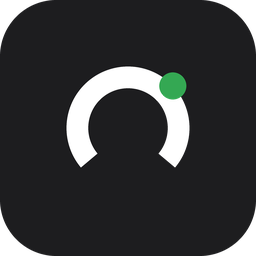

<p align="center">
  
</p>

<h1 align="center">Kerteriz</h1>

<p align="center">
  Fitbit ve Pixel verini Health Connect üzerinden okuyup<br>
  hazırlık, uyku ve yük skorlarına çeviren Android uygulaması.<br>
  <sub>Veri cihazdan çıkmaz.</sub>
</p>

<p align="center">
  <em>An Android app that turns Fitbit and Pixel data into readiness, sleep and load scores.<br>
  Everything is computed on device.</em>
</p>

---

## Ne yapıyor

Bileklik ham ölçümler verir: nabız, uyku evreleri, HRV. Bunlar tek başlarına az
şey söyler. Kerteriz onları **kendi taban çizgine** göre normalize edip bileşik
metriklere çevirir — Whoop ve Bevel'in yaptığı işe yakın, ama veriyi hiçbir yere
göndermeden.

| Metrik | Nasıl |
|---|---|
| **Hazırlık** | HRV %40 · dinlenme nabzı %25 · uyku skoru %25 · solunum + cilt sıcaklığı %10 |
| **Uyku skoru** | Süre %35 · verim %20 · onarıcı evreler %25 · kesintisizlik %10 · zamanlama %10 |
| **Uyku borcu** | Son 14 günün açığı, günde %7 sönümlenerek |
| **Günlük yük** | Bölge ağırlıklı nabız dakikaları (TRIMP), 0–21 logaritmik ölçek |
| **ACWR** | 7 günlük akut yük / 28 günlük kronik yük |
| **Kardiyak toparlanma** | Gece nabzının ne kadar *ve ne kadar erken* düştüğü |
| **Sirkadiyen düzenlilik** | Sleep Regularity Index — ardışık gecelerin örtüşmesi |

Taban çizgiler 14 günlük penceredir ve HRV için logaritmik uzayda kurulur
(RMSSD log-normal dağılır; ham ortalama yanlış sonuç verir).

## Tasarım ilkeleri

- **Renk tek başına anlam taşımaz.** Yeşil-turuncu-kırmızı, kırmızı-yeşil renk
  körlüğünde ayırt edilemeyen üçlüdür; bu yüzden her renkli işaretin yanında
  sayı ve seviye etiketi vardır.
- **Eksik veriyle çalışır.** Bir girdi gelmiyorsa ağırlığı ötekilere oransal
  dağıtılır. Hangi metriğin çalıştığını **Veri** sekmesi açıkça gösterir.
- **Teşhis koymaz.** Kendi verini kendi taban çizgine göre gösterir, o kadar.

## Kurulum

Flutter SDK ve Android SDK gerekiyor. Ayrıntı: [`docs/KURULUM.md`](docs/KURULUM.md)

```bash
bash kurulum.sh          # Flutter projesini üretir ve yamalar
cd ../kerteriz
flutter run              # telefon USB ile bağlıyken
```

`kurulum.sh` Android dosyalarının **üzerine yazmaz**, yamalar: Flutter'ın ürettiği
manifest o sürümün embedding yapılandırmasını doğru taşır, betik yalnızca Health
Connect izinlerini ekler.

## Belgeler

| Dosya | İçerik |
|---|---|
| [`docs/PROJE.md`](docs/PROJE.md) | Mimari, kararlar ve gerekçeler, bütün formüller |
| [`docs/KURULUM.md`](docs/KURULUM.md) | Kurulum, dosya haritası, bağımlılık kısıtları |
| [`docs/YAYIN.md`](docs/YAYIN.md) | Play Store yayın listesi, sağlık verisi beyanı |
| [`docs/GIZLILIK.md`](docs/GIZLILIK.md) | Gizlilik politikası metni |

## Gizlilik

Uygulamanın sunucusu yoktur. Health Connect'e **yalnızca okuma** izniyle erişir,
hiçbir şey yazmaz, analiz ve çökme raporlama kitaplığı içermez, reklam göstermez.
Veri cihazdan yalnızca senin başlattığın dışa aktarma ile çıkar.

## Uyarı

Kerteriz bir tıbbi cihaz değildir. Teşhis koymaz, tedavi önermez, tıbbi tavsiye
vermez. Sağlığıyla ilgili kararlar için bir hekime danışılmalıdır.

## Lisans

Tüm hakları saklıdır — bkz. [LICENSE](LICENSE).
